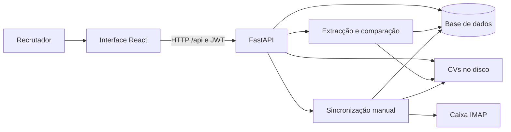
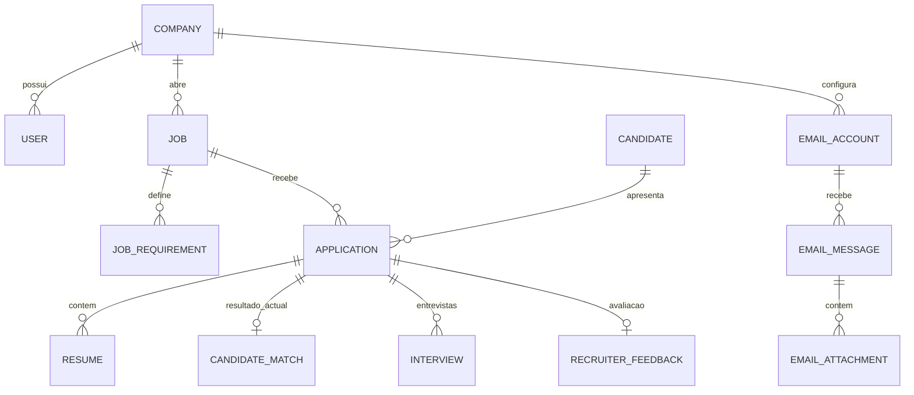

# Descrição e análise do Sistema de Recrutamento Inteligente

Data: 11/09/2026  
Versão: 1.0  
Perspectivas: negócio, análise de sistemas e experiência do utilizador final  
Documento complementar: [Requisitos](requisitos.md)

## 1. O que o projecto faz

Apesar de a pasta se chamar jornadas, a aplicação identifica-se como “Recrutamento Inteligente” e a API como “Sistema Inteligente de Análise e Recomendação de Candidatos”.

É uma aplicação web interna de apoio ao recrutamento. O recrutador cria uma vaga, define critérios com pesos e obrigatoriedade, introduz candidatos através de CVs e solicita uma análise. O sistema extrai texto, procura evidências dos requisitos, calcula uma pontuação de 0 a 100 e apresenta um ranking. O recrutador pode depois agendar entrevistas, alterar o estado da candidatura e guardar a sua avaliação.

O valor pretendido é reduzir a triagem repetitiva e organizar o percurso de selecção com explicações para as recomendações. O sistema conserva uma distinção útil entre a pessoa candidata e cada candidatura a uma vaga.

A implementação tem características de um MVP: o percurso principal existe, mas há lacunas de isolamento, consistência, automação, experiência de utilização e operação. Esta classificação é uma apreciação do analista baseada no código, não uma conclusão de testes de produção.

## 2. Como esta análise foi realizada

Foram examinados a estrutura do projecto, README, código React, rotas FastAPI, schemas, modelos, serviços de extracção e pontuação, integração de e-mail, configuração e testes. Foram comparados os ficheiros de código/documentação/testes equivalentes dos dois backends.

Não foram executados servidores, build, suite de testes, importações de CV, ligação à base de dados, seed, migrações ou sincronizações de e-mail. A análise não mede desempenho, qualidade estatística, comportamento visual num navegador ou disponibilidade de serviços externos. A presença de um teste não significa que tenha passado.

Não foram usados dados pessoais do PDF existente em uploads nem valores do .env. A raiz consultada não é um repositório Git reconhecido. Não foi localizado AGENTS.md nas pesquisas efectuadas no projecto e nos caminhos ascendentes consultados.

Os README fazem referência a um “prompt mestre” e às suas secções, mas esse documento não foi localizado. Não se presume que os comentários sejam uma especificação aprovada. Quando comentário e execução divergem, esta análise descreve o código.

As necessidades e dores dos utilizadores foram inferidas. Não houve entrevistas com recrutadores, gestores ou candidatos.

## 3. Quem utiliza e quem é afectado

| Perfil | O que consegue fazer actualmente | Limites |
|---|---|---|
| Recrutador | Vagas, requisitos, upload, análise, ranking, entrevistas, feedback e configuração de e-mail. | Algumas operações existem só na API; erros e actualizações visuais são incompletos. |
| Administrador | APIs de empresas/utilizadores; acesso amplo às operações de recrutamento. | Não há páginas administrativas; criar vaga ou ligar e-mail exige empresa associada, mesmo para admin. |
| Candidato | Envia CV externamente ou tem os dados introduzidos pelo recrutador. | Sem conta, portal, acompanhamento, confirmação ou resposta automática. |
| Entrevistador/gestor | Pode ser mencionado no campo de entrevistadores. | Não há papéis próprios, tarefas atribuídas nem painel pessoal. |
| Equipa técnica | Configura Python, PostgreSQL, frontend, ficheiros e integrações. | Faltam procedimentos completos de implantação, migração, monitorização e recuperação. |

O utilizador directo principal é o recrutador. O candidato é um interessado essencial, porque erros de leitura, classificação ou associação podem afectar as suas oportunidades mesmo sem ele usar a interface.

## 4. Estrutura do projecto e arquitectura

| Local | Responsabilidade |
|---|---|
| frontend/src/pages | Sete páginas: login, painel, lista de vagas, criação, detalhe da vaga, detalhe da candidatura e e-mail. |
| frontend/src/components | Navegação, protecção de rotas e etiqueta de recomendação. |
| frontend/src/context e lib | Sessão, tokens, cliente HTTP, renovação e mensagens de erro. |
| frontend/src/types | Contratos TypeScript usados pelo cliente. |
| backend/app/api | Endpoints de autenticação, administração, recrutamento, análise, e-mail e indicadores. |
| backend/app/schemas | Validação de pedidos e serialização das respostas. |
| backend/app/models | Persistência relacional das entidades. |
| backend/app/services | Extracção, perfil, comparação, análise e importação de e-mail. |
| backend/app/integrations/email | Abstracção de fornecedores, IMAP e adaptadores OAuth incompletos. |
| backend/tests | Testes unitários e de API. |
| backend/uploads | Ficheiros locais de CV, organizados por identificador de vaga. |
| frontend/backend | Segunda cópia do backend. |

O README do frontend indica ../backend como serviço a consumir. Por isso, este relatório usa backend/ na raiz como referência. O proxy Vite aponta para a porta 8000, sem escolher uma pasta: só a forma como o serviço é iniciado determina qual backend está activo.

Na comparação dos ficheiros equivalentes .py/.md/.txt/.yml/.ini, as diferenças de implementação foram localizadas em app/services/nlp_extraction.py e tests/test_nlp_extraction.py. A cópia da raiz inclui tratamento e testes para limites de palavras, como Java versus JavaScript e Excel versus “excelente”. Existe ainda cache de testes na raiz sem equivalente nessa comparação. Não foi feita alteração ou remoção de qualquer cópia.

### Tecnologias identificadas

- Interface: React 18, TypeScript, React Router, TanStack React Query, Axios, Tailwind CSS e Vite.
- API: Python, FastAPI, Pydantic e SQLAlchemy.
- Persistência prevista: PostgreSQL; Docker Compose configura PostgreSQL 16 e volume persistente.
- Documentos: PyMuPDF para PDF e python-docx para DOCX.
- Análise: regras e sinónimos, Sentence Transformers e alternativa TF-IDF/scikit-learn.
- Segurança: JWT, bcrypt e Fernet para credenciais de e-mail.
- Testes: pytest e TestClient/httpx; base SQLite em memória nas fixtures.

São versões e tecnologias declaradas no projecto, não recomendações de versões actuais.

### Comunicação entre componentes



A sincronização guarda os documentos, mas não chama actualmente o serviço de análise. O diagrama não representa uma fila assíncrona: análise e sincronização são executadas no contexto dos pedidos.

Em desenvolvimento, o navegador comunica com Vite na porta 5173; /api é encaminhado para localhost:8000. Não foi identificada configuração equivalente completa de publicação do frontend/API em produção.

## 5. Percurso funcional, visto pelo recrutador

### 5.1. Entrar e acompanhar o trabalho

O recrutador entra com e-mail e palavra-passe. O cliente guarda access token e refresh token em localStorage, consulta /auth/me e permite acesso às rotas protegidas. A navegação mostra Painel, Vagas, Integração de e-mail e Terminar sessão.

O painel apresenta vagas activas/encerradas, candidatos distintos, candidaturas, análises, recomendações, selecções para entrevista e pendências. A tabela agrupa candidaturas por vaga.

Limites: não há recuperação de palavra-passe, administração visual, página global de candidatos nem visão pessoal de tarefas. O painel não oferece filtros temporais, duração do processo, taxa de contratação ou exportação. O ecrã de login mostra credenciais de demonstração.

### 5.2. Criar e preparar uma vaga

A criação solicita título, código e descrição, permitindo departamento, localização, tipo de trabalho, modalidade, experiência e formação.

Tipos: tempo inteiro, meio período, estágio, contrato e temporário. Modalidades: presencial, remoto e híbrido. A vaga começa em rascunho.

O detalhe contém quatro separadores: visão geral, requisitos, candidatos e ranking. A interface permite adicionar e remover requisitos com categoria, peso e obrigatoriedade; a API também admite descrição e nível esperado, bem como edição.

Categorias: formação, experiência, competência técnica, tecnologia, ferramenta, idioma, certificação, competência comportamental e outro.

Publicar exige ao menos um requisito e muda o estado interno. Não existe portal público ou publicação em sites de emprego: “publicar” não distribui a oferta externamente. Encerrar muda o estado. Arquivar existe apenas na API.

Limites: os pesos podem somar zero; a sugestão visual de 100% não é uma validação de negócio. Formação declarada e nível esperado podem parecer critérios activos sem realmente influenciarem o score da maneira esperada.

### 5.3. Receber candidatos

No separador Candidatos, o recrutador carrega um CV por vez, introduzindo nome e e-mail. A API admite telefone e localização, mas o formulário não os oferece.

O upload aceita extensão PDF/DOCX e verifica tamanho após ler o ficheiro. O limite por omissão é 10 MB, configurável. O documento é guardado com nome UUID numa pasta da vaga.

O sistema reutiliza a pessoa pelo e-mail exacto, mas cria uma nova candidatura em cada upload, inclusive para a mesma pessoa e vaga. A pessoa é global entre empresas. Um upload pode actualizar nome, telefone e localização partilhados.

Carregar não analisa automaticamente. O recrutador precisa de clicar em Analisar. Não há importação múltipla, arrastar-e-largar ou visualização/download do original na interface/API implementada; GET /api/cvs/{id} devolve apenas metadados.

### 5.4. Analisar e comparar

A análise lê o CV, extrai informação, compara requisitos e guarda score, recomendação e detalhe explicativo.

O ranking apresenta candidatos por pontuação, permite filtrar etiquetas e coloca os ainda não analisados no fim. O detalhe da candidatura apresenta pontuação, obrigatórios em falta e evidências por requisito.

Há botão Reanalisar. Contudo, a reanálise substitui o resultado anterior e altera o estado da candidatura; pode apagar o estado operacional de uma pessoa já entrevistada ou contratada. Alterar requisitos não invalida nem recalcula automaticamente resultados antigos.

A API devolve a análise por URL de CV, mas procura CandidateMatch pela candidatura. Como só há um resultado por candidatura, o contrato não preserva uma análise independente por cada documento.

### 5.5. Entrevistar e decidir

O detalhe permite seleccionar qualquer estado da candidatura, agendar entrevista com data/hora e nomes e indicar resultado: agendada, realizada, cancelada ou falta.

A API admite local/link e notas que a interface não oferece. Guardar uma entrevista não envia convite nem cria evento num calendário externo. Não há reagendamento nem gestão de disponibilidade.

O feedback inclui contratado, adequação e comentários. No entanto, a interface envia system_recommended e selected_for_interview sempre como verdadeiros. Também inicializa o formulário a partir de dados normalmente ainda não carregados, sem os sincronizar depois. Isto pode apresentar campos vazios e sobrepor feedback anterior.

Estas limitações são relevantes tanto para a operação actual como para eventual treino futuro com dados históricos.

## 6. Como funciona a análise automática

### Etapas efectivas

1. Colocar candidatura em in_analysis.
2. Extrair texto do ficheiro, se ainda não existir raw_text.
3. Carregar requisitos da vaga; falhar se não existirem.
4. Extrair competências por taxonomia/sinónimos, linhas de formação por palavras-chave, idiomas por ocorrência e estimativa de anos por expressão regular.
5. Comparar cada requisito.
6. Substituir competências, formação e idiomas estruturados da pessoa.
7. Substituir o CandidateMatch da candidatura, guardar score e actualizar estado.
8. Criar ProcessingLog e confirmar persistência.

PDF é lido como texto; não existe OCR. DOCX inclui parágrafos e tabelas. CV digitalizado pode produzir texto vazio sem ser classificado explicitamente como falha de leitura. Erros nativos dos parsers não são todos convertidos para TextExtractionError; o tratamento do serviço só cobre esta excepção e AnalysisError.

Experiência não é reconstruída a partir de datas de empregos. O motor usa a maior menção numérica reconhecida, não soma períodos. Experiências profissionais detalhadas, certificações e projectos têm tabelas, mas não são preenchidos pelo pipeline actual.

### Comparação e pontuação

Para competências conhecidas, encontrar um sinónimo dá correspondência 1. Para outros casos, compara nome/descrição do requisito com o texto do CV. Formação tem tratamento próprio sobre linhas reconhecidas. Experiência usa a proporção entre anos identificados e mínimo exigido, limitada a 1.

```text
contribuição = 100 × (peso / soma dos pesos) × correspondência
score final = soma das contribuições arredondadas, limitada a 0–100
```

Exemplo ilustrativo, sem dados reais:

| Requisito | Peso | Correspondência | Pontos |
|---|---:|---:|---:|
| Python | 0,60 | 1,00 | 60 |
| Experiência | 0,40 | 0,50 | 20 |
| Total | 1,00 | — | 80 |

Com experiência obrigatória não cumprida, a etiqueta será “Requisito obrigatório ausente”, mesmo com 80 pontos. Sem obrigatórios ausentes, 80 dá “Avaliar”.

| Condição | Etiqueta |
|---|---|
| Algum obrigatório não cumprido | Requisito obrigatório ausente |
| Nenhum obrigatório ausente e score >=85 | Recomendado |
| Nenhum obrigatório ausente e score >=65 e <85 | Avaliar |
| Nenhum obrigatório ausente e score <65 | Baixa compatibilidade |

A percentagem é um índice calculado a partir dos requisitos. Não mede probabilidade de sucesso, contratação ou veracidade do CV.

### Limitações do motor

- Sentence Transformers é tentado primeiro; TF-IDF é alternativa se o carregamento falhar. A ordem é diferente da indicada em partes do README.
- O modelo é paraphrase-multilingual-MiniLM-L12-v2; a primeira utilização pode tentar descarregá-lo.
- Sentence Transformers transforma cosseno em (cosseno+1)/2, enquanto TF-IDF usa cosseno directamente. Com limiar 0,35, um cosseno zero torna-se 0,5 no primeiro caminho e passa o limiar. É uma inconsistência matemática identificada, não uma taxa de erro medida.
- A mesma candidatura pode obter resultados diferentes consoante o motor disponível; não se guarda qual foi usado.
- expected_level não participa na comparação; education_level da vaga não se converte automaticamente em requisito.
- Idiomas são extraídos, mas a sua avaliação segue o ramo genérico de competências/semântica.
- Evidência semântica pode ser apenas uma mensagem genérica, sem excerto localizável.
- Correspondência por palavras não interpreta necessariamente negação, contexto ou proficiência.
- O texto completo do CV entra na similaridade, sem anonimização. Não há critérios explícitos de idade/género, mas isso não demonstra ausência de influência indirecta de dados pessoais.
- Não há avaliação estatística, corpus validado ou aprendizagem supervisionada implementada.

## 7. Integração de e-mail: comportamento real

A aplicação trata operacionalmente uma conta por empresa, usando o primeiro registo encontrado, embora o modelo não imponha unicidade de company_id.

O recrutador configura IMAP; a API cifra a palavra-passe e testa a ligação. A interface mostra estado, última sincronização e contadores. O fornecedor tem código para ligar por SSL ou sem SSL; a interface usa os valores predefinidos e não expõe todos os parâmetros.

A sincronização é manual. O campo de frequência por omissão de 15 minutos não tem um agendador associado.

### Importação

1. Ler até 50 mensagens não lidas da INBOX.
2. Procurar código com formato de 2–6 letras maiúsculas, ano e número, no assunto/corpo.
3. Se não resolver por código, procurar o título de uma vaga da empresa.
4. Classificar anexos pelos nomes como CV, certificado, carta ou desconhecido.
5. Se houver apenas um PDF/DOCX desconhecido e nenhum CV identificado, tratá-lo como CV.
6. Usar remetente para nome/e-mail do candidato.
7. Criar candidato/candidatura, guardar CV e registar processamento.

Não chama o pipeline de análise nem incrementa cvs_analyzed_count. Assim, “processado” neste fluxo pode significar apenas importado.

### Casos problemáticos

- Não há controlo por UID persistente nem deduplicação por mensagem/anexo. UNSEEN depende da leitura da caixa e não é garantia de processamento exactamente uma vez.
- O identificador guardado é sequência IMAP, não UID estável. A leitura RFC822 pode marcar a mensagem como lida antes de a importação terminar.
- Mensagens lidas externamente podem ficar fora da pesquisa.
- Mensagem sem vaga gera skipped, mas não preserva anexos nesse ramo nem oferece resolução na interface.
- Associação por título escolhe a primeira ocorrência compatível; não resolve ambiguidade nem exclui vagas encerradas/arquivadas.
- Encaminhamento pode associar o CV ao remetente em vez da pessoa descrita.
- Limite de tamanho do upload manual não é aplicado aos anexos de e-mail.
- Desligar apenas altera estado; credenciais ficam guardadas e a rota de sincronização não bloqueia conta desligada.
- Gmail/Outlook não estão implementados: os métodos lançam erro. Credenciais OAuth, por si só, não completam a integração.

## 8. Modelo de informação



O diagrama resume relações de domínio e chaves estrangeiras; nem todas estão declaradas como relationship no ORM. A multiplicidade de contas reflecte o modelo, embora a API opere uma por empresa.

| Entidade | Conteúdo e particularidades |
|---|---|
| Company | Nome, identificação fiscal, domínio e estado activo. Desactivação preserva registo. |
| User | Nome, e-mail único, hash, papel, empresa opcional e actividade. |
| Job | Código global único, descrição, classificação do trabalho, mínimos, estado e datas. |
| JobRequirement | Critério, categoria, peso, nível, obrigatoriedade e descrição. |
| Candidate | Identidade global pelo e-mail; contactos e relações de perfil/candidaturas. |
| Application | Ligação pessoa/vaga, origem upload/e-mail, score, estado e notas. |
| Resume | Metadados, caminho do ficheiro, texto extraído e candidatura. |
| CandidateMatch | Resultado actual, detalhe JSON, obrigatórios ausentes e instante; único por candidatura. |
| CandidateSkill/Education/Language | Perfil efectivamente escrito pela análise; substituído pela última análise executada sobre a pessoa. |
| CandidateExperience/Certification/Project | Estruturas preparadas, sem preenchimento no pipeline actual. |
| Interview | Data, entrevistadores como texto, local/link, notas, resultado e autor inicial. |
| RecruiterFeedback | Uma avaliação actual por candidatura, indicadores, adequação e comentários. |
| EmailAccount/Message/Attachment | Ligação, segredos cifrados, contadores, identificação de vaga e anexos. |
| ProcessingLog | Origem, documento/contacto, estado, erro e ligações opcionais à candidatura/mensagem. |

O perfil representa a última análise executada, que pode ser de um CV antigo. Não é necessariamente o documento mais recente recebido. A identidade global e a substituição de perfil exigem uma decisão explícita sobre partilha entre empresas.

## 9. Estados e coerência do processo

| Recurso | Estados |
|---|---|
| Vaga | draft, published, closed, archived |
| Candidatura | received, in_analysis, analyzed, recommended, in_evaluation, interview_selected, interviewed, rejected, hired |
| Entrevista | scheduled, completed, cancelled, no_show |
| Conta de e-mail | pending, connected, disconnected, error |
| Log de processamento | processed, error, skipped |

O percurso habitual seria recepção → análise → avaliação → entrevista → decisão. O código não implementa uma máquina de estados que imponha essa ordem.

A recomendação automática e o estado operacional são conceitos diferentes, mas ambos influenciam Application.status. A reanálise ou uma entrevista podem sobrepor uma decisão anterior. O feedback pode indicar contratação e o estado ser posteriormente alterado para outro valor sem reconciliação.

No painel, “analisados” conta CandidateMatch, “recomendados” conta a etiqueta, “em entrevista” conta interview_selected e “por avaliar” conta received/in_analysis/analyzed/in_evaluation. Portanto, “por avaliar” exclui recommended, mesmo que ainda não tenha ocorrido avaliação humana. Estes significados precisam de validação com o negócio.

## 10. Mapa de API e interface

| Área | Rotas principais | Disponibilidade visual |
|---|---|---|
| Sessão | /api/auth/login, refresh, logout, me | Login/logout; logout visual é local. |
| Empresas | /api/companies e /{id}, criar/listar/consultar/editar/desactivar | Ausente. |
| Utilizadores | /api/users e /{id}, criar/listar/consultar/editar/desactivar | Ausente. |
| Vagas | /api/jobs e /{id}; /publish; /close; DELETE arquiva | Criação, consulta, pesquisa, publicação e encerramento. |
| Requisitos | /api/jobs/{id}/requirements; /api/requirements/{id} | Adição, consulta e remoção; edição ausente. |
| Recepção | POST /api/jobs/{id}/cvs; GET /cvs e /candidates da vaga | Upload individual/lista. |
| Pessoas | /api/candidates; /{id}; /{id}/applications | Sem área global. |
| CV | GET /api/cvs/{id} | Sem original; rota devolve metadados. |
| Estado | PATCH /api/applications/{id}/status | Selector no detalhe. |
| Análise | POST /api/cvs/{id}/analyze; GET /analysis; GET /api/jobs/{id}/ranking | Disponível. |
| Entrevistas | /api/applications/{id}/interview e /interviews; /api/interviews/{id}/result | Parcial. |
| Feedback | GET/PUT /api/applications/{id}/feedback | Disponível, com problemas de fidelidade. |
| E-mail | /api/email/connect, status, sync, disconnect | IMAP; aviso para OAuth incompleto. |
| Histórico | GET /api/processing-logs, filtros status/source e limite 100 por omissão, máximo 500 | Ausente. |
| Indicadores | /api/dashboard/summary e /applications-by-job | Painel. |
| Saúde | /api/health | Sem ecrã; resposta não testa BD, disco ou fornecedor de e-mail. |

Fontes: [routers](backend/app/api/) e [rotas da interface](frontend/src/App.tsx). Os GET de listagens, em geral, devolvem listas completas sem paginação.

## 11. Achados prioritários e impacto

| ID | Achado estático | Impacto para negócio/utilizador | Referência | Requisitos |
|---|---|---|---|---|
| A01 | Lista/detalhe/histórico de candidato e metadados de CV verificam autenticação, mas não empresa. | Exposição de identidade e percurso de candidaturas entre empresas. | api/candidates.py | RF03, RNF01 |
| A02 | Funções de vagas filtram apenas se company_id tiver valor; recruiter pode ser criado sem empresa. | Possibilidade de consultar/alterar vagas fora do âmbito previsto. | api/jobs.py; schemas/user.py | RF03, RF05 |
| A03 | Perfil e identidade globais actualizados por diferentes candidaturas. | Uma empresa pode afectar dados usados por outra. | api/candidates.py; services/analysis_service.py | RF11, RNF01 |
| A04 | Feedback fixa dois indicadores em true e não repõe dados carregados no formulário. | Histórico e futuras métricas/treino podem ficar incorrectos. | pages/CandidateDetailPage.tsx | RF20 |
| A05 | Reanálise substitui resultado e estado, sem versões ou invalidação por critérios. | Perda da decisão operacional e comparação de scores desactualizados. | services/analysis_service.py; api/job_requirements.py | RF13, RF18 |
| A06 | Normalização de similaridade e limiar partilhado não equivalentes. | Possíveis falsos positivos e resultados dependentes do ambiente. | services/embeddings.py; matching_engine.py | RNF06 |
| A07 | Importação e-mail não executa análise, nem garante idempotência. | Trabalho manual e duplicações; contadores não descrevem o percurso completo. | services/email_sync_service.py | RF25, RF26 |
| A08 | Conta desligada ainda pode ser sincronizada pela API. | Comportamento contrário à expectativa de interrupção do acesso. | api/email.py | RF28 |
| A09 | Falhas de consulta/mutação sem tratamento visível em vários ecrãs. | “A carregar...” indefinido, ausência confundida com erro, repetição de acções. | pages/JobDetailPage.tsx; CandidateDetailPage.tsx; DashboardPage.tsx | RNF04 |
| A10 | Cache de React Query não é limpo no logout e usa chaves sem identidade/empresa. | Risco de apresentação transitória de dados da sessão anterior num navegador partilhado. | AuthContext.tsx; main.tsx; pages | RF02, RNF01 |
| A11 | /auth/me fica excluído do refresh automático por ser rota /auth/. | Ao reabrir com access token expirado, a sessão pode ser descartada mesmo com refresh válido. | lib/api.ts; AuthContext.tsx | RF02 |
| A12 | Texto vazio e falhas nativas de parser sem tratamento integral; anexos sem limite equivalente. | Avaliações sem evidência válida, tarefas presas e consumo excessivo de recursos. | text_extraction.py; analysis_service.py; email_sync_service.py | RF12, RF14 |
| A13 | Empresa inactiva não bloqueia acesso; logout sem revogação. | Controlos administrativos não correspondem totalmente à intenção. | api/deps.py; auth.py; companies.py | RF02, RF04 |
| A14 | Backend duplicado e README desactualizados. | Correcções aplicadas na cópia errada e expectativas incorrectas. | backend/; frontend/backend/; README | RNF10 |

Caminhos abreviados acima são relativos a backend/app ou frontend/src, conforme a extensão/contexto. Estes achados não foram explorados contra um serviço real. Prioridade técnica não equivale a prova de ocorrência num ambiente em produção.

## 12. Experiência do utilizador final

### Recrutador: necessidade de rapidez e confiança

“Tenho dezenas de candidaturas. Quero saber quais merecem leitura cuidadosa, mas preciso de explicar porquê.”

O ranking e o detalhe por requisito respondem a esta necessidade. Porém, upload individual, análise individual, impossibilidade de abrir o original e ausência de tarefas em lote mantêm uma parte significativa do trabalho manual. Um score elevado sem evidência concreta pode criar confiança excessiva.

Proposta: reunir recepção, estado de análise, CV original e evidências num percurso contínuo; mostrar pendências e permitir revisão antes de decisões negativas.

### Recrutador: necessidade de controlo

“Quero corrigir um requisito e saber se a alteração mudou a avaliação.”

Actualmente, editar requisitos exige API ou remover/adicionar na UI, e resultados antigos continuam guardados. Proposta: identificar versão dos critérios, sinalizar análises desactualizadas e permitir recálculo sem alterar decisões já tomadas.

### Administrador: necessidade de autonomia

“Quero adicionar uma pessoa à equipa e retirar acesso quando necessário.”

A API suporta parte disto, mas não há interface. Desactivar empresa não bloqueia os seus utilizadores. Proposta: administração visual e regras de acesso que correspondam às acções apresentadas.

### Candidato: necessidade de ser recebido e compreendido

“Enviei o meu CV e quero ter a certeza de que foi considerado.”

Não há confirmação, consulta do estado ou canal de correcção. Um PDF digitalizado, um CV encaminhado ou uma mensagem sem código reconhecido pode comprometer a recepção. Proposta: confirmação e tratamento de excepções; avaliar um portal apenas se o volume e a política justificarem.

### Gestor e entrevistador: necessidade de contexto

“Quero saber quem vou entrevistar, o que confirmar e onde registar a minha avaliação.”

Os nomes existem apenas como texto e a entrevista não gera convite. Proposta: clarificar colaboração, agenda, acesso restrito e critérios de feedback antes de acrescentar novos papéis.

### Acessibilidade e erros

O layout usa barra lateral fixa de largura 240 px, formulários em várias colunas e evidências numa linha. Isso sugere dificuldades em ecrãs pequenos, mas não houve teste visual para as confirmar. É necessário validar teclado, contraste, leitura assistida, dispositivos móveis e mensagens de erro.

A interface invalida apenas alguns caches depois de alterações; entrevista/feedback nem sempre actualizam o estado visível da candidatura ou o ranking. Uma confirmação de gravação deve ser acompanhada pela actualização dos dados relacionados.

## 13. Operação, configuração e qualidade

A API usa .env via pydantic-settings. DATABASE_URL explícita tem prioridade; em alternativa monta a ligação a partir de DB_*. Segredos de desenvolvimento, duração dos tokens, CORS, uploads e ambiente têm valores predefinidos no código. Não foram inspeccionados os valores efectivos do .env.

O tempo de acesso por omissão é 60 minutos e o refresh dura 7 dias. Credenciais de e-mail usam Fernet com chave derivada do mesmo SECRET_KEY usado no JWT; alterar a chave afecta também a desencriptação dessas credenciais.

Em development, o arranque chama Base.metadata.create_all. Alembic consta das dependências, mas não há migrações formais no projecto consultado. Docker Compose fornece apenas a base de dados. Não foi identificada configuração completa para backups, recuperação de documentos/chaves, filas, observabilidade, limitação de pedidos ou implantação automatizada.

Os testes cobrem autenticação, vagas/requisitos, upload/deduplicação de pessoa, extracção, pontuação, ranking, entrevistas, feedback, alguns cenários de e-mail, dashboard e logs. Há testes de limites de palavras adicionais no backend da raiz.

Cuidados sobre a suite:

- Fixtures usam SQLite em memória e directório temporário para uploads.
- TestClient entra no ciclo de vida da aplicação; em development, create_all ainda usa o engine configurado da aplicação. Substituir get_db não substitui automaticamente esse engine.
- O teste de host IMAP inacessível tenta ligação a localhost:1; o comentário “sem rede real” não descreve integralmente esse teste.
- Testes de matching podem tentar carregar/descarregar o modelo porque o backend semântico não está fixado nas fixtures.
- Não há testes de frontend declarados, nem validação completa de sincronização IMAP bem-sucedida nos testes inspeccionados.
- Os testes não foram executados nesta análise; não se afirma que passam.

## 14. O que está fora do sistema actual

Não foram identificados: portal público de vagas/candidatos, candidatura autónoma online, publicação externa de ofertas, envio de mensagens, convites de calendário, entrevistas por vídeo integradas, provas técnicas, propostas salariais, assinatura de contratos, integração com folha salarial, aprendizagem supervisionada ou relatórios exportáveis.

Há entidades e comentários que antecipam evolução, mas não constituem funcionalidades completas.

## 15. Orientação para a próxima fase

Antes de expandir a automação, convém resolver isolamento entre empresas, fidelidade do feedback, preservação de estados, controlo de documentos e coerência dos resultados de análise. Estes pontos sustentam a confiança do recrutador e a qualidade do tratamento dado aos candidatos.

A seguir, completar a operação quotidiana: edição visual, consulta de CV, lotes, histórico, recuperação e gestão de acessos. OAuth e comunicação externa devem seguir uma definição clara dos utilizadores e do processo.

O [requisitos.md](requisitos.md) traduz este diagnóstico em requisitos identificados, prioridades e critérios de aceitação. As decisões de negócio pendentes devem ser validadas antes de transformar as propostas em compromisso de desenvolvimento. Este trabalho limita-se à análise e à produção dos dois documentos.


## 16. Direcção de evolução confirmada

O destino imediato do produto é **compreender CVs com IA e gerar propostas de questionário por vaga**, com edição, aprovação e guarda pelo recrutador.

O questionário é gerado a partir da descrição/requisitos da vaga, sem depender de CV ou candidato. A proposta inclui perguntas, opções quando aplicável, respostas esperadas e critérios de avaliação. O recrutador pode usar o conteúdo numa entrevista ou imprimi-lo para aplicação externa.

Convites, área do candidato, respostas online, cronómetro e correcção automática de tentativas não fazem parte desta construção inicial. Integração de instrumentos psicométricos é uma possibilidade posterior; não constitui dependência para gerar propostas de perguntas.

A análise dos CVs continuará separada: perfil estruturado, evidências localizadas, compatibilidade por regras e revisão humana. Gerar/aprovar questionário não altera pontuação ou decisão de candidatos.

A [proposta reorganizada](proposta_ia_avaliacoes.md) descreve o produto; a secção 12 de [requisitos.md](requisitos.md) identifica requisitos activos e adiados; [tasks.md](tasks.md) define tarefas, dependências e critérios de conclusão.

As secções anteriores descrevem o código analisado, não funcionalidades futuras implementadas. Esta reorganização é apenas documental.
