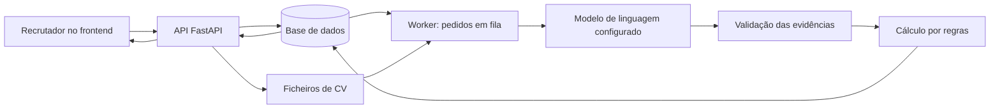

# Explicação do projecto de recrutamento inteligente

Documento elaborado a partir do código e da configuração local consultados em 21 de Setembro de 2026. A primeira parte explica o projecto sem exigir conhecimentos de programação; a segunda indica os ficheiros e funções responsáveis por cada operação.

## 1. O que é o projecto?

É uma plataforma de apoio ao recrutamento. Ajuda uma empresa a organizar vagas, receber currículos, comparar os candidatos com os requisitos de cada função e preparar perguntas para entrevistas.

Imagine uma vaga com muitos candidatos. O recrutador precisa de perceber quem apresenta as competências pedidas, quais os pontos por confirmar e que perguntas deve fazer na entrevista. O sistema reúne essa informação e apresenta uma avaliação fundamentada no CV.

A plataforma apoia a decisão do recrutador. Uma percentagem de compatibilidade não significa que a pessoa foi contratada ou rejeitada.

## 2. Como funciona para o utilizador?

1. **Definir a vaga.** Indicar o título, a descrição e os requisitos. Cada requisito pode ter um peso e ser obrigatório.
2. **Registar candidaturas.** Enviar um CV em PDF ou DOCX e associá-lo à vaga. Existe também integração de e-mail, dependente da configuração da conta.
3. **Pedir a análise.** O sistema lê o documento e compara as informações disponíveis com os requisitos. O envio manual do ficheiro guarda o CV; a análise é pedida através da acção própria.
4. **Consultar a explicação.** Ver quais os requisitos comprovados, parcialmente comprovados, não comprovados ou contraditórios, com justificações e referências ao texto.
5. **Preparar a entrevista.** Gerar perguntas adequadas à função e às competências escolhidas, rever as respostas esperadas e aprovar o questionário.
6. **Acompanhar o processo.** Consultar candidaturas, agendar entrevistas e registar etapas e decisões.

O histórico permite distinguir análises feitas com versões diferentes do CV ou dos requisitos da vaga.

## 3. O que significa a percentagem?

A percentagem representa a correspondência ponderada entre as evidências do CV e os requisitos da vaga.

| Resultado de um requisito | Pontos atribuídos |
| --- | --- |
| Comprovado | 100% do peso desse requisito |
| Parcialmente comprovado | 50% do peso |
| Não comprovado | 0% do peso |
| Informação contraditória | 0% do peso |

Exemplo ilustrativo para uma vaga administrativa:

| Requisito | Peso | O que a análise encontrou | Contributo |
| --- | ---: | --- | ---: |
| Gestão documental | 40 | Comprovado | 40 pontos |
| Excel | 30 | Parcialmente comprovado | 15 pontos |
| Atendimento ao público | 20 | Comprovado | 20 pontos |
| Inglês | 10 | Não comprovado | 0 pontos |
| **Total** | **100** | | **75 pontos: 75%** |

Uma explicação possível seria: «O CV comprova gestão documental e atendimento ao público, apresenta evidência parcial de Excel e não apresenta informação suficiente para confirmar inglês. Considerando o peso de cada requisito, a compatibilidade apurada é de 75%.»

Os pesos não precisam de somar 100: o sistema divide o resultado pela soma dos pesos e converte-o para percentagem.

**Não comprovado não significa que a pessoa não sabe fazer.** Significa que o documento não permite confirmar essa competência. Esse ponto pode ser esclarecido na entrevista.

### Requisitos obrigatórios e recomendação

Na política actual, um requisito obrigatório sem comprovação completa condiciona a recomendação, mesmo que a percentagem seja elevada.

Quando todos os requisitos obrigatórios estão comprovados:

- A partir de 80%: «Recomendado».
- De 50% até menos de 80%: «Compatibilidade parcial».
- Abaixo de 50%: «Baixa compatibilidade».

Estas são regras definidas no programa, não previsões estatísticas de sucesso profissional. A avaliação pode ser revista por uma pessoa e não determina, por si só, a contratação.

## 4. Os questionários adaptam-se à área da vaga?

Sim. O pedido de geração utiliza o título e a descrição da vaga, os requisitos seleccionados, o formato, o idioma e a dificuldade pretendida.

Por exemplo, uma vaga de contabilidade com requisitos de reconciliação bancária deve originar perguntas sobre essa actividade; uma vaga de informática com requisitos de programação deve originar perguntas relacionadas com programação. São exemplos do comportamento pretendido, não perguntas fixas guardadas no sistema.

Há duas ideias distintas:

- **Área profissional:** resulta do contexto da vaga, como contabilidade, administração ou informática.
- **Área de avaliação:** é a categoria do requisito, como experiência, competências técnicas, idiomas ou ferramentas.

O selector «Área de avaliação» filtra as categorias dos requisitos da vaga. Não é um catálogo independente de profissões. Para obter perguntas adequadas, é necessário descrever bem a função e configurar os requisitos correspondentes.

Cada pergunta gerada fica ligada a um requisito e deve incluir uma resposta esperada e critérios de avaliação. O recrutador pode editar, pedir uma nova proposta, aprovar uma versão e imprimir a folha de perguntas ou o guia com respostas.

No ecrã, as respostas ficam recolhidas no botão «Ver resposta». A folha de perguntas para impressão não inclui as respostas internas. A geração continua a exigir revisão humana: a ligação a um requisito não garante que a pergunta produzida tenha a qualidade desejada.

## 5. O projecto usa redes neurais?

**Na configuração consultada, sim: utiliza um modelo de linguagem pré-treinado. O projecto não treina uma rede neural própria.**

Os valores relevantes encontrados na configuração carregada pelo backend foram:

| Configuração | Valor observado | Significado |
| --- | --- | --- |
| `AI_PROVIDER` | `openai-compatible` | Comunicação com um serviço através de uma API compatível com Chat Completions |
| `AI_MODEL` | `openai/gpt-oss-120b` | Identificador do modelo solicitado ao fornecedor |
| `AI_REAL_ENABLED` | `true` | Uso de IA real activado na configuração |
| `AI_DATA_APPROVED` | `true` | Indicador de autorização de dados activado na configuração |
| `LEGACY_ANALYSIS_ENABLED` | `false` | Endpoint do motor antigo desactivado |
| `LOCAL_EMBEDDINGS_ENABLED` | `false` | Embeddings neurais opcionais do motor antigo desactivados |

Esta leitura confirma a configuração, não a disponibilidade do fornecedor nem a execução bem-sucedida de uma análise. Não foram feitas chamadas ao modelo para produzir este documento. Variáveis de ambiente podem sobrepor o ficheiro `.env`, e processos já iniciados podem manter valores anteriores.

O modelo gpt-oss usa uma arquitectura de rede neural Transformer com mistura de especialistas, segundo a [documentação oficial do modelo](https://openai.com/index/introducing-gpt-oss/).

Em linguagem simples, o modelo já foi treinado antes de ser integrado no projecto. A aplicação envia-lhe informações para interpretar e recebe uma resposta. Utilizar um modelo já treinado chama-se **inferência**. Treiná-lo seria alterar os seus parâmetros com dados e um processo de aprendizagem; esse processo não está implementado aqui.

`openai-compatible` descreve o formato de comunicação. Não significa, por si só, que o serviço é operado pela OpenAI. O destino é definido por `AI_ENDPOINT`. Nesta modalidade, o código envia o texto preparado e os requisitos ao endpoint configurado; não se deve descrever a análise como inteiramente local.

### O que faz a IA e o que faz o programa?

| Responsabilidade | Quem a executa |
| --- | --- |
| Ler o conteúdo textual do PDF/DOCX | Bibliotecas de leitura de documentos |
| Interpretar evidências e propor a classificação de cada requisito | Modelo de linguagem |
| Gerar perguntas, respostas esperadas e critérios | Modelo de linguagem |
| Verificar estrutura, referências e algumas inconsistências | Código de validação |
| Calcular a percentagem e aplicar os limites da recomendação | Regras matemáticas escritas no backend |
| Aprovar questionários e decidir sobre a candidatura | Recrutador |

A pontuação é determinística **para os mesmos pesos e estados de evidência**. Uma nova interpretação do modelo pode alterar esses estados e, consequentemente, a pontuação.

## 6. Porque existe código que não usa redes neurais?

O repositório conserva um motor anterior, baseado em regras e comparação de texto. Isso pode dar a impressão de que todo o projecto funciona dessa forma.

Esse motor combina:

- **Dicionários e sinónimos:** procuram competências conhecidas no texto.
- **Expressões regulares:** identificam padrões, como referências a anos de experiência.
- **TF-IDF:** representa palavras por valores numéricos, dando importância à sua distribuição nos textos comparados.
- **Similaridade de cosseno:** compara os vectores resultantes.
- **Regras de correspondência e pontuação:** combinam os resultados dos requisitos.

TF-IDF e similaridade de cosseno não são redes neurais. A semelhança entre palavras também não equivale a uma compreensão completa do sentido do CV.

Existe ainda uma opção antiga com Sentence Transformers, que utiliza um modelo neural para gerar representações de texto. Se essa opção estiver desactivada ou não puder carregar o modelo, essa camada usa TF-IDF. **Este fallback pertence ao motor antigo; não é um substituto automático da IA do fluxo actual quando o fornecedor falha.**

| Caminho | Técnica | Situação observada |
| --- | --- | --- |
| Análise profissional actual | Modelo de linguagem + validações + pontuação por evidências | Fornecedor configurado como `openai-compatible` |
| Motor antigo | Regras + TF-IDF/cosseno por defeito | Endpoint desactivado |
| Embeddings opcionais do motor antigo | Sentence Transformers | Desactivados |
| Simulador `mock` | Respostas artificiais para testes | Não é o fornecedor configurado |

Os limites de recomendação do motor antigo são diferentes. Não devem ser utilizados para explicar a percentagem do fluxo actual.

## 7. Organização técnica

| Parte | Tecnologia | Responsabilidade |
| --- | --- | --- |
| Frontend | React, TypeScript, Tailwind CSS e Vite | Ecrãs, formulários e apresentação dos resultados |
| Comunicação do frontend | Axios e TanStack Query | Pedidos à API, cache e acompanhamento de operações |
| Backend | Python e FastAPI | Regras, autenticação, validação e endpoints |
| Persistência | SQLAlchemy, PostgreSQL e migrações Alembic | Registos, relações e evolução da estrutura da base de dados |
| Processamento em segundo plano | Worker Python e tabela de execuções | Processar pedidos de análise e geração |
| Leitura de documentos | PyMuPDF e python-docx | Extrair texto de PDF e DOCX |
| IA | Adaptadores de fornecedores | Comunicar com o modelo seleccionado |



No questionário, o worker utiliza o contexto da vaga e não necessita de um CV. O diagrama representa sobretudo a análise de candidaturas.

## 8. Onde fica cada funcionalidade no backend?

Os caminhos seguintes são relativos a este documento e podem ser abertos num visualizador de Markdown.

### Acesso, vagas e candidaturas

| Funcionalidade | Ficheiro | Funções principais |
| --- | --- | --- |
| Arrancar a API e registar rotas | [main.py](../backend/app/main.py) | `lifespan()`, `health_check()`; objecto `app` |
| Ler configuração | [core/config.py](../backend/app/core/config.py) | `Settings`, `get_settings()` |
| Abrir sessões da base de dados | [core/database.py](../backend/app/core/database.py) | `get_db()`, `SessionLocal` |
| Login, renovação e logout | [api/auth.py](../backend/app/api/auth.py) | `login()`, `issue_tokens()`, `refresh_token()`, `logout()`, `get_me()` |
| Validar utilizador e permissões | [api/deps.py](../backend/app/api/deps.py) | `get_current_user()`, `validate_company()`, `require_roles()` |
| Criar e gerir vagas | [api/jobs.py](../backend/app/api/jobs.py) | `create_job()`, `list_jobs()`, `get_job()`, `update_job()`, `publish_job()`, `close_job()`, `archive_job()` |
| Gerir requisitos e pesos | [api/job_requirements.py](../backend/app/api/job_requirements.py) | `create_requirement()`, `update_requirement()`, `delete_requirement()` |
| Guardar versões dos critérios | [services/criteria.py](../backend/app/services/criteria.py) | `snapshot()`, `preserve()`, `changed()` |
| Receber CV e criar candidatura | [api/candidates.py](../backend/app/api/candidates.py) | `upload_cv()`, `_find_or_create_candidate()` |
| Validar PDF/DOCX | [services/documents.py](../backend/app/services/documents.py) | `validate_document()` |
| Consultar candidatura e descarregar CV | [api/candidates.py](../backend/app/api/candidates.py) | `application_detail()`, `download_cv()` |
| Alterar etapa da candidatura | [api/candidates.py](../backend/app/api/candidates.py), [services/application_state.py](../backend/app/services/application_state.py) | `update_application_status()`, `transition()` |

### Análise e inteligência artificial

| Funcionalidade | Ficheiro | Funções principais |
| --- | --- | --- |
| Verificar configuração e pedir análise | [api/professional_analysis.py](../backend/app/api/professional_analysis.py) | `analysis_configuration()`, `start_analysis()` |
| Consultar histórico e efectuar revisão humana | [api/professional_analysis.py](../backend/app/api/professional_analysis.py) | `history()`, `review()`; a revisão está disponível na API |
| Colocar pedidos na fila | [services/executions.py](../backend/app/services/executions.py) | `enqueue()`; evita repetir pedidos com a mesma chave e conteúdo |
| Reservar e processar uma execução | [services/executions.py](../backend/app/services/executions.py) | `claim()`, `process_one()`, `execution_timeout()` |
| Manter o processamento em funcionamento | [worker.py](../backend/app/worker.py) | `main()` |
| Coordenar leitura, avaliação e pontuação | [services/professional_analysis.py](../backend/app/services/professional_analysis.py) | `prepare_result()` |
| Guardar e devolver a análise | [services/professional_analysis.py](../backend/app/services/professional_analysis.py) | `persist_result()`, `serialize()` |
| Extrair texto com localização | [services/located_text.py](../backend/app/services/located_text.py) | `extract_located()` |
| Seleccionar o fornecedor de IA | [services/ai_provider.py](../backend/app/services/ai_provider.py) | `get_provider()`, `configuration_error()`, `require_analysis_provider()` |
| Chamar a API configurada actualmente | [services/ai_provider.py](../backend/app/services/ai_provider.py) | `ChatCompletionsProvider.complete()` |
| Alternativas de fornecedor | [services/ai_provider.py](../backend/app/services/ai_provider.py) | `OllamaProvider.complete()`, `JsonHTTPProvider.complete()`, `MockProvider.complete()` |
| Definir instruções do modelo | [services/ai_provider.py](../backend/app/services/ai_provider.py) | Constante `SYSTEM_POLICY`; não contém pesos de uma rede neural |
| Preparar fragmentos e reconstruir citações | [services/compact_evaluation.py](../backend/app/services/compact_evaluation.py) | `prepare()`, `expand()` |
| Formar o resumo dos requisitos comprovados | [services/compact_evaluation.py](../backend/app/services/compact_evaluation.py) | `supported_profile()` |
| Validar respostas e citações | [services/ai_service.py](../backend/app/services/ai_service.py) | `run()`, `validate_citation()` |
| Definir formatos de resposta | [schemas/ai.py](../backend/app/schemas/ai.py) | `Evaluation`, `Evidence`, `Profile`, `GenerationConfig`, `GeneratedQuestionnaire` |
| Calcular percentagem e recomendação | [services/scoring.py](../backend/app/services/scoring.py) | `calculate_score()`; constantes `CONTRIBUTION` e `POLICY_VERSION` |
| Consolidar informação para listagens | [services/analysis_overview.py](../backend/app/services/analysis_overview.py) | `overview()` |
| Consultar ranking da vaga | [api/analysis.py](../backend/app/api/analysis.py) | `get_job_ranking()` |

No fornecedor actual, `assessment_only = True`: a avaliação é pedida ao modelo e o perfil apresentado é construído a partir dos requisitos comprovados. Não se deve apresentar esse resumo como uma extracção completa de toda a carreira do candidato.

### Questionários, entrevistas e acompanhamento

| Funcionalidade | Ficheiro | Funções principais |
| --- | --- | --- |
| Pedir perguntas adaptadas à vaga | [api/questionnaires.py](../backend/app/api/questionnaires.py) | `generate()`; envia configuração e fotografia dos critérios para a fila |
| Criar, editar e copiar questionário | [api/questionnaires.py](../backend/app/api/questionnaires.py) | `create_manual()`, `save_version()`, `fork_version()` |
| Aprovar, arquivar e aplicar proposta | [api/questionnaires.py](../backend/app/api/questionnaires.py) | `approve()`, `archive()`, `apply_generation()` |
| Consultar execução e repetir tentativa | [api/questionnaires.py](../backend/app/api/questionnaires.py) | `get_execution()`, `retry()` |
| Preparar impressão | [api/questionnaires.py](../backend/app/api/questionnaires.py) | `print_version()`; separa perguntas e guia com respostas |
| Validar e guardar versões | [services/questionnaires.py](../backend/app/services/questionnaires.py) | `validate_content()`, `create_version()`, `replace_questions()`, `reserve_edit()` |
| Gerir entrevistas e feedback | [api/interviews.py](../backend/app/api/interviews.py) | `schedule_interview()`, `list_interviews()`, `update_interview_result()`, `upsert_feedback()` |
| Indicadores do painel | [api/dashboard.py](../backend/app/api/dashboard.py) | `get_dashboard_summary()`, `get_applications_by_job()` |
| Configurar e sincronizar e-mail | [api/email.py](../backend/app/api/email.py) | `connect_email_account()`, `trigger_sync()`, `get_email_status()` |
| Processar mensagens e anexos | [services/email_sync_service.py](../backend/app/services/email_sync_service.py) | `sync_account()`, `_process_message()`, `_identify_job()` |
| Consultar registos de processamento | [api/processing_logs.py](../backend/app/api/processing_logs.py) | `list_processing_logs()` |

### Código do motor antigo

| Ficheiro | Responsabilidade |
| --- | --- |
| [services/analysis_service.py](../backend/app/services/analysis_service.py) | `analyze_resume()`: coordena o fluxo antigo |
| [services/nlp_extraction.py](../backend/app/services/nlp_extraction.py) | `extract_profile()`, `extract_skills()`, `extract_education_lines()`, `extract_languages()`, `extract_experience_years()`: extracção por regras |
| [services/embeddings.py](../backend/app/services/embeddings.py) | `semantic_similarity()`, `_get_backend()`, `_TfidfBackend`, `_SentenceTransformerBackend`: comparação de texto |
| [services/matching_engine.py](../backend/app/services/matching_engine.py) | `compute_match()`: correspondência e pontuação antigas |
| [api/analysis.py](../backend/app/api/analysis.py) | `analyze_cv()`: endpoint antigo, bloqueado quando `LEGACY_ANALYSIS_ENABLED=false` |

## 9. Onde ficam os ecrãs e comportamentos do frontend?

| O que aparece ou acontece | Ficheiro / componente |
| --- | --- |
| Rotas e páginas activas | [App.tsx](../frontend/src/App.tsx), `App()` |
| Navegação e estrutura administrativa | [Layout.tsx](../frontend/src/components/Layout.tsx), `Layout()` |
| Cores, tipografia e estilos | [tailwind.config.js](../frontend/tailwind.config.js), [index.css](../frontend/src/index.css) |
| Login e sessão | [LoginPage.tsx](../frontend/src/pages/LoginPage.tsx), [AuthContext.tsx](../frontend/src/context/AuthContext.tsx), [ProtectedRoute.tsx](../frontend/src/components/ProtectedRoute.tsx) |
| Pedidos HTTP e tratamento de erros | [api.ts](../frontend/src/lib/api.ts) |
| Painel de indicadores | [DashboardPage.tsx](../frontend/src/pages/DashboardPage.tsx), `DashboardPage()` |
| Lista e criação de vagas | [JobsListPage.tsx](../frontend/src/pages/JobsListPage.tsx), [JobCreatePage.tsx](../frontend/src/pages/JobCreatePage.tsx) |
| Detalhes, requisitos e candidaturas da vaga | [JobDetailPage.tsx](../frontend/src/pages/JobDetailPage.tsx), `JobDetailPage()` |
| CV, pedido de análise e histórico da candidatura | [CandidateOverview.tsx](../frontend/src/pages/CandidateOverview.tsx), `CandidateOverview()`, funções internas `analyze()` e `download()` |
| Explicação da percentagem e requisitos | [CompatibilitySummary.tsx](../frontend/src/components/CompatibilitySummary.tsx), `CompatibilitySummary()` |
| Etiquetas de recomendação e processamento | [RecommendationBadge.tsx](../frontend/src/components/RecommendationBadge.tsx), [AnalysisStatusBadge.tsx](../frontend/src/components/AnalysisStatusBadge.tsx) |
| Geração, edição e aprovação de questionários | [QuestionnaireEditor.tsx](../frontend/src/components/QuestionnaireEditor.tsx), `QuestionnaireEditor()`, funções internas `generate()`, `save()` e `changeQuestion()` |
| Botão «Ver resposta» | No mesmo `QuestionnaireEditor.tsx`: estado `visibleAnswers` e evento `onClick` de cada pergunta |
| Impressão de perguntas ou guia | [QuestionnairePrintPage.tsx](../frontend/src/pages/QuestionnairePrintPage.tsx), [QuestionnaireSheet.tsx](../frontend/src/components/QuestionnaireSheet.tsx) |
| Entrevistas | [InterviewSection.tsx](../frontend/src/components/InterviewSection.tsx), `InterviewSection()` |
| Configuração de e-mail | [EmailSettingsPage.tsx](../frontend/src/pages/EmailSettingsPage.tsx), `EmailSettingsPage()` |

A página de candidatura actualmente registada em `App.tsx` é `CandidateOverview`. A existência de outro ficheiro, como `CandidateDetailPage.tsx`, não significa que esteja ligado às rotas activas.

## 10. Percurso técnico de uma análise

1. `CandidateOverview.analyze()` envia `POST /api/cvs/{resume_id}/analysis-executions`.
2. `start_analysis()` verifica permissões, requisitos e integridade do documento, preserva os critérios e chama `enqueue()`.
3. `worker.main()` executa `process_one()`, que reserva um pedido com `claim()`.
4. `prepare_result()` extrai o texto localizado do documento.
5. No fornecedor actual, `compact_evaluation.prepare()` organiza o texto em fragmentos identificados; `ChatCompletionsProvider.complete()` solicita a avaliação.
6. `expand()` transforma os identificadores devolvidos em citações do texto original. `ai_service.run()` verifica a estrutura, a cobertura dos requisitos e aplica validações adicionais.
7. `calculate_score()` calcula o resultado a partir dos pesos e estados validados.
8. `persist_result()` guarda a análise, as evidências, o método e a versão dos critérios.
9. O frontend consulta a execução e o histórico; `CompatibilitySummary()` apresenta a explicação.

A verificação de uma citação confirma que o texto existe no documento. Não garante, por si só, que toda a interpretação feita pelo modelo está correcta.

## 11. O que tem de estar a funcionar?

O frontend, a API e o worker são processos diferentes. A base de dados também precisa de estar disponível. O fornecedor de IA configurado precisa de estar acessível para processar análises e gerar perguntas.

Com as dependências e a base de dados já preparadas, executar em terminais separados, a partir da raiz do projecto:

**Frontend:**

```powershell
cd frontend
npm run dev
```

**API:**

```powershell
cd backend
.\.venv\Scripts\python.exe -m uvicorn app.main:app --reload
```

**Worker:**

```powershell
cd backend
.\.venv\Scripts\python.exe -m app.worker
```

Sem a API, o Vite pode apresentar `ECONNREFUSED` nos pedidos `/api/...`. Sem o worker, os pedidos de IA podem ficar em fila. Duas instâncias a tentar usar a porta 8000 podem impedir o arranque. Não é necessário iniciar Ollama para o caminho `openai-compatible`; Ollama é uma alternativa de fornecedor.

## 12. Limites e forma correcta de apresentar o projecto

- Não há treino ou ajuste fino de uma rede neural implementado neste projecto.
- Não existe aprendizagem automática contínua a partir das decisões do recrutador. Guardar feedback não equivale a treinar um modelo.
- Não há OCR implementado neste fluxo: um PDF que contenha apenas imagens pode ficar sem avaliação.
- A interpretação depende do modelo, da qualidade do CV e da clareza dos requisitos.
- O código tem testes funcionais, mas isso não demonstra, por si só, a precisão da IA sobre uma população real de candidatos. Seria necessária uma avaliação com exemplos e resultados de referência.
- Nesta elaboração foram consultados código e configuração; não se efectuou uma nova avaliação de qualidade do modelo nem um teste integral dos serviços.

Uma descrição adequada para apresentar o trabalho é:

> O projecto é uma plataforma de apoio ao recrutamento que organiza vagas e candidaturas, utiliza um modelo de linguagem pré-treinado para interpretar evidências nos currículos e gerar questionários contextualizados, e aplica regras explícitas para calcular a compatibilidade com os requisitos. As justificações e referências ao CV apoiam a revisão e a decisão do recrutador.
