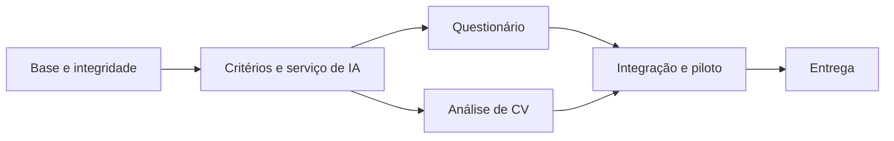

# Tasks de construção do sistema

Versão: 1.0 · Data: 11/09/2026  
Estado: backlog de implementação — todas as tarefas por iniciar  
Âmbito: [Proposta reorganizada](proposta_ia_avaliacoes.md) · [Requisitos](requisitos.md) · [Diagnóstico](descricao_sistema.md)

> Actualização de âmbito — 14/09/2026: o feedback do recrutador deixa de fazer parte do fluxo da candidatura. Criar a entrevista é a única intervenção necessária nesta etapa e actualiza automaticamente o estado. Revisão de evidências e alterações manuais de estado são opcionais. Esta decisão substitui as exigências de formulário de feedback em T06, T24 e T27; a API e os registos anteriores mantêm-se por compatibilidade.

> Actualização da análise — 15/09/2026: avaliação e recomendação são automáticas, sem revisão humana obrigatória nem alteração manual de estado no ecrã. Uma API externa substitui Ollama por limitações de hardware; fornecedor e modelo ainda por seleccionar. Consulte [análise automática](docs/analise-automatica.md). Esta decisão prevalece sobre exigências anteriores de revisão obrigatória da análise.

## 1. Objectivo da entrega

Entregar uma aplicação em que o recrutador:

1. Gere vagas e critérios com dados isolados por empresa.
2. Receba CVs e obtenha análise por significado, com evidências e revisão.
3. Gere com IA uma proposta de questionário por vaga.
4. Edite, aprove, guarde e imprima o questionário para aplicação externa.
5. Acompanhe ranking, entrevistas e decisões sem perda de consistência.

Não construir nesta entrega: convites, portal/realização online, respostas de candidatos, cronómetro, correcção de tentativas ou integração psicométrica. A aplicação do questionário ocorre fora do módulo; ele prepara conteúdo e guia do recrutador.

## 2. Como utilizar o backlog

Cada tarefa tem entrega, dependências, requisitos e critério de conclusão. Marcar como concluída apenas depois de implementar e verificar o comportamento indicado, não apenas criar ficheiros.

Prioridades: P0 = condição de integridade/qualidade para disponibilizar; P1 = funcionalidade central. Uma tarefa P0 pode depender de P1 técnica: seguir as dependências, não apenas ordenar pela prioridade.

Esforço relativo: S = alteração localizada; M = várias camadas; L = integração complexa que deverá ser dividida durante implementação. Não são estimativas de dias. Não há prazo/orçamento acordado nem sprint calendarizada.

Os estados I/P/A de requisitos descrevem presença no código antigo. Todas as tarefas aqui começam pendentes, inclusive correcções de funcionalidades já existentes. Este documento não autoriza alterações adicionais fora do âmbito definido.

## 3. Marcos e dependências

| Marco | Tarefas | Entrega demonstrável |
|---|---|---|
| M0 — Base controlada | T01–T07 | Fonte única, ambiente de teste seguro e dados/estados protegidos. |
| M1 — Serviço comum e critérios | T08–T11 | Vagas editáveis e IA com contrato, versões e execução recuperável. |
| M2 — Questionário utilizável | T12–T17 | Gerar, rever, aprovar, reabrir e imprimir uma proposta por vaga. |
| M3 — CV compreendido por IA | T18–T23 | Extrair perfil, verificar evidências, calcular compatibilidade e rever. |
| M4 — Operação e entrega | T24–T30 | Fluxos integrados, piloto aprovado e implantação recuperável. |

M2 e M3 são linhas independentes após a base comum. Começar por M2 permite demonstrar cedo o questionário; M3 não exige que existam respostas ao questionário.

## 4. Tarefas

### T01 — Consolidar a fonte de código e preservar diferenças

- [ ] P0 · M · Área: arquitectura/backend
- **Entrega:** definir backend/ como fonte de execução; comparar a cópia frontend/backend, preservar diferenças úteis e ajustar instruções/importações antes de retirar duplicação.
- **Dependências:** nenhuma.
- **Requisitos:** RNF10.
- **Concluída quando:** comandos de desenvolvimento/teste usam uma só fonte; testes adicionais de limites de palavras são preservados; nenhuma referência depende da cópia retirada; alterações anteriores e uploads não são perdidos.
- **Nota:** confirmar execução e dependências antes de qualquer remoção; não apagar pastas apenas por parecerem duplicadas.

### T02 — Preparar testes seguros e registo do comportamento inicial

- [ ] P0 · M · Área: backend/qualidade
- **Entrega:** isolar engine de arranque, BD, uploads, rede e modelos nos testes; preparar dados fictícios de duas empresas.
- **Dependências:** T01.
- **Requisitos:** RNF11.
- **Concluída quando:** suite não toca no .env/BD operacional nem tenta descarregar modelo; falhas iniciais ficam identificadas; testes relevantes podem correr sem IMAP ou fornecedor externo.

### T03 — Introduzir migrações e estratégia para dados existentes

- [ ] P0 · M · Área: persistência
- **Entrega:** esquema inicial versionado, caminho de adopção da BD existente e procedimento de recuperação.
- **Dependências:** T01, T02.
- **Requisitos:** RNF09, RNF10.
- **Concluída quando:** instalação vazia e cópia de BD existente chegam ao mesmo esquema, sem perda de dados; processo deixa de depender de create_all em produção; recuperação é ensaiada em dados de teste.

### T04 — Corrigir isolamento e regras de acesso

- [ ] P0 · L · Área: backend
- **Entrega:** âmbito de empresa em candidatos, documentos, histórico e vagas; bloquear recruiter sem empresa e actividade de empresa inválida; resolver actualização global da identidade/perfil.
- **Dependências:** T02, T03.
- **Requisitos:** RF03–RF05, RF11, RNF01.
- **Concluída quando:** duas empresas com candidato do mesmo e-mail não expõem nem alteram dados uma da outra; listas e acesso directo respeitam âmbito; administrador tem política explícita; migração de identidade preserva candidaturas.

### T05 — Corrigir sessão e cache do navegador

- [ ] P0 · M · Área: frontend/backend
- **Entrega:** limpar cache ao sair/mudar sessão, renovar acesso expirado no arranque e revogar renovação quando aplicável.
- **Dependências:** T02, T03, T04.
- **Requisitos:** RF01, RF02, RNF01, RNF02.
- **Concluída quando:** iniciar sessão com outra empresa no mesmo navegador não apresenta dados anteriores; refresh falhado termina pedidos pendentes; token revogado não renova sessão; ecrã não fica preso a carregar.

### T06 — Separar resultado de análise, estado operacional e feedback

- [ ] P0 · L · Área: domínio/backend/frontend
- **Entrega:** definir transições, preservar decisões na reanálise e corrigir indicadores fixados em true e formulário assíncrono de feedback.
- **Dependências:** T02–T04.
- **Requisitos:** RF18–RF20, RF34, RNF03.
- **Concluída quando:** contratação/rejeição/entrevista sobrevivem à reanálise; feedback reabre fielmente; valores de recomendação/selecção reflectem os factos; acções contraditórias são recusadas ou resolvidas por regra documentada.

### T07 — Proteger recepção e consulta dos documentos

- [ ] P0 · M · Área: backend/frontend
- **Entrega:** validar identidade, tamanho, conteúdo e formato; guardar versões/hashes; permitir download/consulta autorizada do CV.
- **Dependências:** T03, T04.
- **Requisitos:** RF11–RF13, RNF03.
- **Concluída quando:** extensão falsa, documento vazio/corrompido, e-mail inválido e excesso de tamanho têm erro útil sem registos parciais; reenvio segue política explícita; outra empresa não obtém ficheiro; ficheiro/BD não ficam incoerentes após falha.

### T08 — Completar edição da vaga e versionar critérios

- [ ] P1 · M · Área: frontend/backend
- **Entrega:** editar dados e requisitos completos; validar pesos; criar versão dos critérios e sinalizar resultados dependentes desactualizados.
- **Dependências:** T03, T04, T06.
- **Requisitos:** RF07–RF09, RF34, RF38.
- **Concluída quando:** edição é possível pela UI; soma zero é recusada para análise; papel de formação/nível esperado é explícito; mudar requisitos não modifica resultados/questionários já aprovados; vaga sem requisitos informa o que falta.

### T09 — Definir e comparar fornecedores de IA

- [ ] P1 · M · Área: análise técnica/produto
- **Entrega:** contrato comum para análise e geração; comparação de API gerida e opção privada com exemplos fictícios/autorizados, critérios de dados, custo e tempo.
- **Dependências:** T02.
- **Requisitos:** RNF02, RNF06, RNF13.
- **Concluída quando:** escolha é documentada com limitações, política de dados, custos medidos por operação e alternativa em caso de falha; não há dados reais enviados sem base/autorização apropriada.
- **Decisão pendente:** fornecedor, credenciais e orçamento. Preparar mock permite continuar tarefas sem depender da contratação.

### T10 — Implementar serviço comum de IA e validação de saídas

- [ ] P0 · L · Área: backend/IA
- **Entrega:** operações separadas de extracção/avaliação e geração de questionário; schemas validados, versões de instruções, timeouts e limites.
- **Dependências:** T03, T04, T09.
- **Requisitos:** RF31–RF34, RF37, RNF12.
- **Concluída quando:** resposta inválida não chega ao domínio como válida; modelo não acessa ferramentas de alteração/envio; instruções maliciosas no documento/descrição não alteram a política; segredo não aparece em logs/respostas; fornecedor pode ser substituído sem reescrever a UI.

### T11 — Executar operações de IA em segundo plano

- [ ] P0 · L · Área: backend/operação
- **Entrega:** fila/worker com estado persistido, idempotência, timeout, limite de novas tentativas e consulta de progresso.
- **Dependências:** T03, T04, T10.
- **Requisitos:** RF14, RF51, RNF03, RNF05, RNF07.
- **Concluída quando:** reiniciar worker não perde trabalho confirmado; clique repetido não duplica resultados; falha mantém conteúdo anterior; pedidos só consultam execuções autorizadas; indisponibilidade aparece como erro recuperável.

### T12 — Criar domínio e API de questionários versionados

- [ ] P1 · M · Área: backend/persistência
- **Entrega:** Questionnaire, Version, Question e ligação à execução de geração; CRUD de rascunho, leitura e guarda com controlo de concorrência.
- **Dependências:** T03, T04, T08.
- **Requisitos:** RF35, RF38, RF48.
- **Concluída quando:** vaga sem candidatos pode guardar questionário; dados isolados por empresa; ordem/opções/rubricas sobrevivem à leitura; conflito de edição não sobrepõe silenciosamente trabalho de outro utilizador.

### T13 — Gerar proposta de questionário a partir da vaga

- [ ] P1 · L · Área: IA/backend
- **Entrega:** configuração de competências, categoria, formato, quantidade, dificuldade e idioma; geração com vínculo aos requisitos, perguntas e critérios.
- **Dependências:** T08, T10–T12.
- **Requisitos:** RF37, RF47, RF51.
- **Concluída quando:** saída respeita configuração, competência e idioma; escolha única tem chave válida e alternativas distintas; aberta tem rubrica; conteúdo inválido gera falha/revisão; toda proposta nasce como rascunho.
- **Cenário obrigatório:** gerar questionário de gestor de armazém numa vaga sem candidatos.

### T14 — Construir editor de questionário na vaga

- [ ] P1 · L · Área: frontend
- **Entrega:** separador Questionário com configuração, estado de geração, lista ordenável e edição de enunciados, opções, resposta esperada e rubrica.
- **Dependências:** T12, T13.
- **Requisitos:** RF35, RF47, RF48, RF51, RNF04.
- **Concluída quando:** acrescentar/remover/reordenar/guardar/reabrir preserva conteúdo; erros permitem recuperação; interface alerta para alterações não guardadas; navegação por teclado funciona.

### T15 — Regenerar sem perder trabalho humano

- [ ] P1 · M · Área: IA/frontend/backend
- **Entrega:** nova proposta por pergunta ou conjunto, com comparação e escolha de substituição.
- **Dependências:** T13, T14.
- **Requisitos:** RF49, RF51.
- **Concluída quando:** rejeitar nova proposta mantém original; aplicar substitui apenas o alvo escolhido; falha ou nova tentativa não apagam edições; questionário aprovado origina rascunho, sem alteração retroactiva.

### T16 — Aprovar, arquivar e acompanhar versões

- [ ] P0 · M · Área: frontend/backend
- **Entrega:** estados, revisão, aprovação por utilizador autorizado, autoria/data e histórico; sinalizar alterações nos requisitos da vaga.
- **Dependências:** T08, T12, T14, T15.
- **Requisitos:** RF38, RF34, RNF07.
- **Concluída quando:** versão aprovada é imutável na API e UI; editar gera outra versão; aprovação exige perguntas/rubricas válidas; conteúdo manual e gerado têm proveniência; desactualização não muda conteúdo.

### T17 — Pré-visualizar e imprimir perguntas e guia

- [ ] P1 · M · Área: frontend
- **Entrega:** modos de impressão folha de perguntas e guia do recrutador, usando impressão do navegador/guardar em PDF.
- **Dependências:** T14, T16.
- **Requisitos:** RF50, RNF04.
- **Concluída quando:** folha não contém respostas, dicas internas ou rubricas, inclusive no conteúdo renderizado dessa versão; guia contém critérios; ordem/opções e acentos preservados; vaga/versão e indicação de rascunho aparecem; páginas não cortam conteúdo essencial.

### T18 — Extrair texto localizado e tratar documentos digitalizados

- [ ] P1 · L · Área: backend/documentos
- **Entrega:** PDF/DOCX com páginas/secções e estado de qualidade; OCR quando necessário ou encaminhamento explícito para revisão.
- **Dependências:** T07, T11.
- **Requisitos:** RF14, RF33.
- **Concluída quando:** PDF textual, DOCX tabular e PDF digitalizado têm destino correcto; texto vazio nunca produz falsa avaliação válida; erro do parser é registado e recuperável; localização permite encontrar evidência no original.
- **Decisão técnica:** escolher OCR e limites no teste representativo; modo sem OCR deve declarar não avaliável, sem simular capacidade.

### T19 — Extrair perfil profissional com IA

- [ ] P1 · L · Área: IA/backend
- **Entrega:** experiências, actividades, datas, formação, competências e idiomas com trechos verificáveis.
- **Dependências:** T10, T18.
- **Requisitos:** RF31–RF33.
- **Concluída quando:** curso não vira experiência de emprego; negação não vira competência; datas sobrepostas não duplicam anos; dados desconhecidos permanecem assim; campos não sustentados são recusados/sinalizados.

### T20 — Avaliar evidências por requisito

- [ ] P0 · L · Área: IA/backend
- **Entrega:** comparação requisito/trechos com estados de evidência e justificações; diferenciar categoria genérica de tecnologia específica.
- **Dependências:** T08, T19.
- **Requisitos:** RF31, RF33, RNF06, RNF12.
- **Concluída quando:** equivalências de redacção são reconhecidas sem inventar produtos, duração ou proficiência; trechos citados existem; texto contraditório fica visível; backend/método usado é registado.

### T21 — Calcular compatibilidade com política versionada

- [ ] P0 · M · Área: domínio/IA
- **Entrega:** regras de conversão evidência→contribuição, pesos e tratamento de obrigatórios, com correção da normalização semântica actual.
- **Dependências:** T06, T08, T20.
- **Requisitos:** RF09, RF15, RF17, RNF06.
- **Concluída quando:** valores conhecidos reproduzem pontuação esperada; obrigatórios não evidenciados aparecem explicitamente; resultado não avaliável não é nota zero; similaridade bruta não equivale a cumprimento; política/modelo são identificáveis.
- **Decisão de produto:** aprovar significado dos níveis e limiares; não fixar valores experimentais como se estivessem validados.

### T22 — Guardar análises históricas e correcções

- [ ] P0 · M · Área: backend/persistência
- **Entrega:** AnalysisRun/Evidence por versão de CV/critérios e revisão humana auditável.
- **Dependências:** T03, T06, T07, T20, T21.
- **Requisitos:** RF13, RF16, RF18, RF34, RNF07.
- **Concluída quando:** reanalisar mantém execuções anteriores e decisão humana; correcção guarda autor/motivo e ligação ao original; mudar critérios sinaliza desactualização; resultado identifica documento exacto.

### T23 — Mostrar perfil, evidências e revisão no detalhe do candidato

- [ ] P1 · L · Área: frontend
- **Entrega:** progresso, perfil estruturado, evidências navegáveis, lacunas, versões, correcção e nova análise.
- **Dependências:** T07, T11, T22.
- **Requisitos:** RF13–RF17, RF33, RF34, RNF04.
- **Concluída quando:** recrutador abre excerto/documento, distingue facto/inferência e falha de leitura, revê resultado e vê histórico; nenhuma acção altera contratação de forma implícita; erro é recuperável.

### T24 — Integrar ranking, entrevistas, feedback e painel

- [ ] P1 · M · Área: frontend/backend
- **Entrega:** actualizar caches/contagens após alterações; labels coerentes, tratamento de erro e paginação nos percursos com volume.
- **Dependências:** T05, T06, T16, T23.
- **Requisitos:** RF10, RF17–RF21, RNF04, RNF05.
- **Concluída quando:** ranking mostra análise válida/desactualizada/pendente claramente; feedback e entrevista actualizam estado/painel; questionário gerado/aprovado não mexe no ranking; contagens distinguem pessoas de candidaturas.

### T25 — Controlar exposição da integração de e-mail existente

- [ ] P0 · M · Área: backend/operação
- **Entrega:** desligar efectivamente conta e impedir uso de recepção não fiável na versão entregue; decidir corrigir ou desactivar módulo por configuração.
- **Dependências:** T04, T07, T11.
- **Requisitos:** RF24–RF28, RNF01, RNF03.
- **Concluída quando:** conta desligada não sincroniza; se módulo estiver activo, limites, idempotência e revisão de falhas estão verificados; caso contrário, API e UI bloqueiam importação e explicam indisponibilidade.
- **Fora desta tarefa:** OAuth e envio de convites; geração de questionário funciona sem e-mail.

### T26 — Preparar conjunto de avaliação e metas do piloto

- [ ] P0 · M · Área: produto/qualidade
- **Entrega:** exemplos fictícios/autorizados e critérios de revisão para CVs e questionários; separar desenvolvimento e avaliação final.
- **Dependências:** T08, T09.
- **Requisitos:** RNF06, RNF13.
- **Concluída quando:** existem casos de paráfrases, negação, tecnologia não mencionada, CV sem texto, instruções maliciosas e perguntas irrelevantes/duplicadas; metas de aceitação são registadas antes de observar o resultado final.
- **Revisão humana:** responsáveis avaliam relevância, clareza, resposta/rubrica, cobertura de requisitos e qualidade das evidências.

### T27 — Verificar ponta a ponta e regressões relevantes

- [ ] P0 · L · Área: qualidade
- **Entrega:** testes backend e frontend dos cenários de negócio e isolamento, com fornecedor simulado; integração real limitada em ambiente de teste autorizado.
- **Dependências:** T17, T23–T26.
- **Requisitos:** RNF01, RNF03, RNF11–RNF13.
- **Concluída quando:** passam geração sem candidatos, edição/reabertura, aprovação imutável, impressão sem gabarito, erro/nova tentativa, isolamento, reanálise e feedback; nenhum teste toca em dados operacionais.
- **Não basta:** contar testes ou verificar apenas funções que repetem a implementação.

### T28 — Executar piloto e resolver desvios

- [ ] P0 · L · Área: produto/IA/qualidade
- **Entrega:** relatório comparando base actual e solução, tempo/custo, erros de evidência e qualidade editorial dos questionários.
- **Dependências:** T26, T27.
- **Requisitos:** RNF06, RNF13.
- **Concluída quando:** metas previamente definidas são cumpridas ou limitações impedem activar a funcionalidade correspondente; casos problemáticos têm correcção ou revisão obrigatória; revisor consegue explicar cada resultado.
- **Foco:** medir utilidade e fidelidade, não afirmar validade psicométrica de perguntas geradas.

### T29 — Preparar implantação, configuração e recuperação

- [ ] P0 · L · Área: operação
- **Entrega:** configuração por ambiente, serviços API/frontend/worker, migrações, gestão de segredos, logs operacionais e backup de BD/documentos/chaves.
- **Dependências:** T03, T05, T11, T25, T27.
- **Requisitos:** RNF02, RNF05, RNF07–RNF10.
- **Concluída quando:** ambiente limpo é instalado de forma reproduzível; conta/segredo de demonstração não são aceites em produção; estado de dependências é observável; backup é restaurado num ensaio; política de dados e acesso a fornecedores está definida.
- **Limite:** preparar entrega não equivale a publicar em produção sem decisão de disponibilização.

### T30 — Aceitar entrega e actualizar documentação operacional

- [ ] P1 · M · Área: produto/documentação
- **Entrega:** guia do recrutador, operação, limitações, migração e demonstração dos dois percursos de IA.
- **Dependências:** T28, T29.
- **Requisitos:** RF31–RF35, RF37, RF38, RF47–RF51, RNF10.
- **Concluída quando:** responsável valida os cenários da secção 5; requisitos reflectem o que foi entregue; backlog futuro permanece separado; documentação explica que não existem convites/respostas online no MVP.

## 5. Cenários obrigatórios de aceitação

| Cenário | Resultado esperado | Tarefas |
|---|---|---|
| Vaga sem candidatos → gerar questionário | Rascunho útil sem exigir candidatura, e-mail ou convite. | T12–T14 |
| Editar e reabrir | Perguntas, opções, ordem e rubricas preservadas. | T14 |
| Regenerar uma pergunta | Proposta nova, original preservado até escolha explícita. | T15 |
| Aprovar e depois editar | Nova versão em rascunho; aprovada inalterada. | T16 |
| Imprimir para aplicação externa | Folha sem respostas; guia separado com critérios. | T17 |
| Descrição equivalente no CV | Evidência reconhecida sem inventar tecnologia específica. | T19–T21 |
| Documento ilegível | Não avaliável, com erro e acção disponível; sem falso score. | T18, T23 |
| Candidato contratado → reanalisar | Contratação e histórico mantidos. | T06, T22 |
| Utilizador de outra empresa | Sem acesso a CV, análise, questionário, guia ou geração. | T04, T27 |
| IA indisponível/pedido duplicado | Erro recuperável, sem perda nem duplicação de conteúdo. | T10, T11, T27 |
| Alterar requisitos após aprovação | Sinaliza desactualização, sem alterar versões aprovadas. | T08, T16, T22 |

## 6. Rastreabilidade da construção imediata

| Grupo de requisitos | Tarefas principais |
|---|---|
| RF01–RF05, RNF01–RNF03 | T04, T05, T29; administração visual completa adiada. |
| RF07–RF09, RF34 | T08, T16, T22 |
| RF10–RF14 | T07, T11, T18, T24 |
| RF15–RF21 | T06, T20–T24 |
| RF24–RF28 | T25, com alternativa explícita de desactivação. |
| RF31–RF33 | T18–T23 |
| RF35, RF37, RF38 | T12, T13, T16 |
| RF47–RF51 | T11, T13–T17 |
| RNF04–RNF07, RNF11–RNF13 | T02, T10, T11, T14, T23, T26–T28 |
| RNF08–RNF10 | T01, T03, T09, T29, T30 |

RF06, RF22/RF23 completos, RF27 visual, RF29/RF30 e capacidades administrativas completas ficam no backlog geral para planeamento posterior. RNF14/RNF15 e RF36/RF39–RF46 estão adiados por dependerem de avaliações formais/online.

## 7. Backlog futuro, sem dependência para concluir o MVP

- B01 — Administração visual completa e recuperação de palavra-passe.
- B02 — E-mail automático fiável, OCR ampliado conforme formatos reais e processamento em grandes lotes.
- B03 — Convites, portal do candidato, respostas online e gestão de tentativas.
- B04 — Correcção de respostas e relatórios de desempenho, com rubricas aprovadas.
- B05 — Instrumentos psicométricos validados e fornecedores especializados.
- B06 — Modelos reutilizáveis de questionários entre vagas e biblioteca editorial avançada.
- B07 — Relatórios, exportações operacionais e integrações com calendário.
- B08 — Treino/ajuste de modelos com histórico fiável, após avaliação de necessidade.

As tarefas B não entram automaticamente na implementação nem bloqueiam T30. Reutilização básica por versões na mesma vaga pertence ao MVP; biblioteca transversal avançada é B06.

## 8. Decisões a fechar durante a construção

| Decisão | Momento | Trabalho que pode avançar antes |
|---|---|---|
| Fornecedor de IA, dados permitidos e orçamento | T09, antes de processar dados reais | Schemas, mocks, UI e testes fictícios. |
| Limites de geração e exemplos por função | T13/T26 | Formulário configurável e validação estrutural. |
| Regras e limiares de compatibilidade | T21/T26 | Extracção/evidências e testes de cálculo. |
| Política de candidato partilhado entre empresas | T04 | Usar isolamento como requisito; não manter escrita global insegura. |
| OCR e infraestrutura de execução | T18/T29 | Texto localizado e estado não avaliável. |
| Recepção IMAP activa ou desactivada na primeira entrega | T25 | Questionário e upload manual independentes. |
| Aprovação do piloto e disponibilização | T28/T30 | Ambiente de teste, guia e pacote de implantação. |

Este backlog não contém tarefas já concluídas. O trabalho realizado nesta revisão foi exclusivamente reorganizar a documentação e planear a construção.
